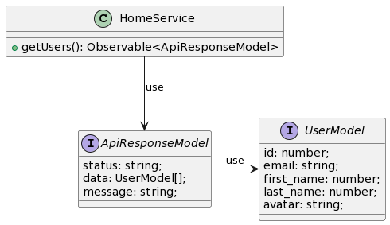
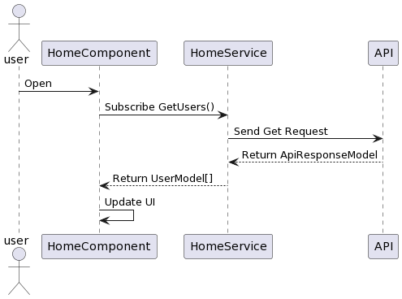

# Display Users

This document is an overview of the test project for a user interface that reads and displays a list of user information from the API.

This Project was generated with `Angular version 16.1.4`.

## Install Prerequisites

- Open the project with Visual Studio Code
- Go to the Terminal menu and create a `new terminal`
- Run the following command in Terminal.
  - `npm install`

## Run Project

Run `ng serve --open` for a dev server.

## Running unit tests

Run `ng test` to execute the unit tests via [Karma](https://karma-runner.github.io).

## API

I have used the following IP address to call the fake data.
https://reqres.in/api/users

## Class Diagram

## Component Diagram

## See Also

- [Angular CLI](https://github.com/angular/angular-cli)
